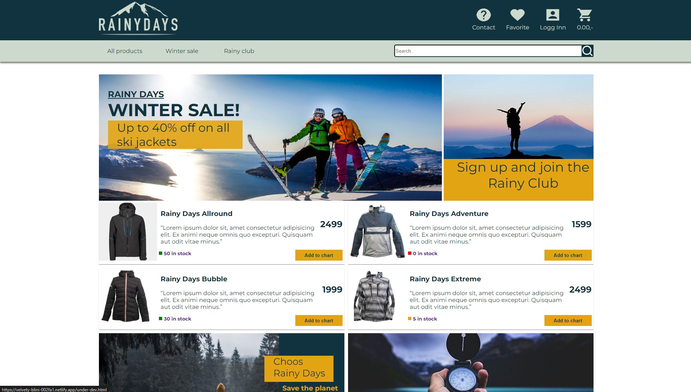

# Rainy Days



My first webpage built with html, css and js.

## Description

Add a more detailed description of what your project entails and set out to do.

- web commerce
- Rain jackets
- sports commerce
- WordPress as headless cms

## Built With

You can list a the tech stack that you've used over here

- HTML
- CSS
- JavaScript

## Getting Started

### Installing

1. Clone the repo:

```bash
gh repo clone ebergeng/RainyDays
```

### Running

Run index.html with with live server inn VS Code or just open it in a web-browser.


## Contributing

Here you can detail any information you want to provide regarding contributing to the project. For big projects you will usually have a separate `CONTRIBUTING.md` and link to it, but for smaller projects you can simply include instructions here. These instructions can simply detail the process you want a person to take, such as to make sure to open a pull request so code can be reviewed.

## Contact
